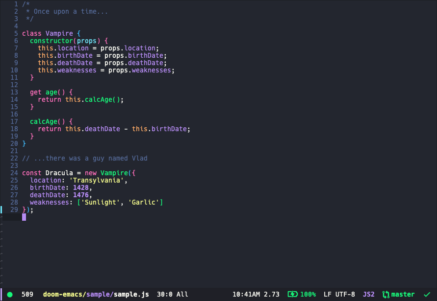

# Dracula for [DOOM Emacs](https://github.com/hlissner/doom-emacs)

> A dark theme for [DOOM Emacs](https://github.com/hlissner/doom-emacs).

## Install

All instructions can be found at [draculatheme.com/doom-emacs](https://draculatheme.com/doom-emacs).

## Team

This theme is maintained by the following person(s) and a bunch of [awesome contributors](https://github.com/dracula/doom-emacs/graphs/contributors).

 |
--- |
[Helder B. Berto](https://github.com/helderburato) |

## License

[MIT License](./LICENSE)
